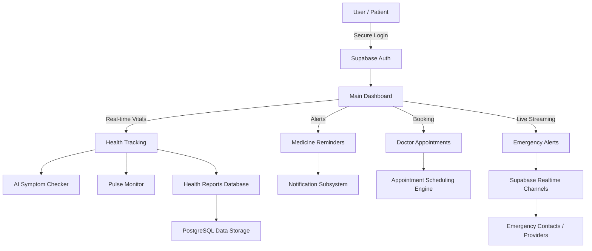

# Nirogya Health Assistant

## Overview
Nirogya is a comprehensive, real-time healthcare platform designed to empower users to manage their health effectively. It provides features such as vital tracking, medicine reminders, doctor appointment scheduling, AI-driven symptom checking, and real-time emergency alerts. The platform operates as a robust ecosystem seamlessly syncing data and delivering actionable insights for both patients and healthcare providers.

## Tech Stack & Tools
- **Frontend**: React, TypeScript, Vite, Tailwind CSS
- **Backend & Database**: Supabase (PostgreSQL, Authentication, Storage, Realtime channels)
- **Code Quality**: ESLint, PostCSS

## Installation/Setup Instructions
1. **Clone the repository:**
   ```bash
   git clone https://github.com/your-username/nirogya.git
   ```
2. **Navigate to the project directory:**
   ```bash
   cd Nirogya-main
   ```
3. **Install dependencies:**
   ```bash
   npm install
   ```
4. **Environment Setup:**
   Create a `.env` file in the root directory and add your Supabase connection keys:
   ```env
   VITE_SUPABASE_URL=your_supabase_project_url
   VITE_SUPABASE_ANON_KEY=your_supabase_anon_key
   ```
5. **Start the development server:**
   ```bash
   npm run dev
   ```
6. **Access the application:**
   Open your browser and navigate to the localhost URL provided in the terminal (usually `http://localhost:5173`).

## Features
- **Real-time Health Tracking**: Monitor and log vitals like pulse or blood pressure, and generate dynamic health reports directly synced via Supabase.
- **AI-Driven Diagnostics**: Advanced symptom checker integrating intelligent diagnostic features.
- **Medicine Reminders**: Reliable scheduling and managing of medication intake with timed notifications.
- **Doctor Appointments**: Complete booking flow allowing users to schedule and track upcoming consultations.
- **Emergency System**: Critical, real-time emergency alerts that instantly notify predefined contacts using Supabase Realtime channels when vitals become abnormal.
- **Secure Authentication**: End-to-end secure login and registration flow allowing users to access their unique dashboards.

## Technical Workflow
